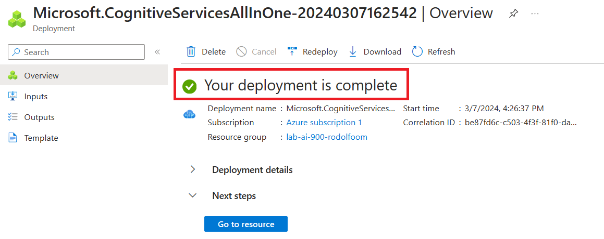

# AI-900: Azure Cognitive Search - Utilizando AI Search para Indexação e Consulta de Dados

-green)

-blue)

 

## Índice

- [Descrição do Projeto](#Descrição-do-Projeto)
- [Acessos necessários](#Acessos-necessários)
- [Introdução](#Introdução)
- [Aprovisionando os recursos necessários do Azure](#Aprovisionando-os-recursos-necessários-do-Azure)
- [Carregando os documentos no Azure Account](#Carregando-os-documentos-no-Azure-Account)
- [Indexando os documentos](#Indexando-os-documentos)
- [Consultando o Índice](#Consultando-o-Índice)
- [Revisando a base de conhecimento](#Revisando-a-base-de-conhecimento)
- [Conclusão](#Conclusão)
- [Limpando o ambiente](#Limpando-o-ambiente)
- [Certificados e Certificações Associados ao Projeto](#Certificados-e-Certificações-Associados-ao-Projeto)

 

## Descrição do Projeto

Este projeto é um dos laboratórios do Bootcamp [Microsoft Azure AI Fundamentals](https://web.dio.me/track/microsoft-azure-ai-fundamentals), promovido através da parceria entre a Microsoft e a Dio.me.

Os alunos deste bootcamp tem, como principal objetivo, se prepararem para o exame de certificação Microsoft AI-900, dominando conceitos como visão computacional, classificação inteligente de imagem e inteligência de documentos com IA, enquanto se familiarizam com as tecnologias da Microsoft Azure.

Este desafio é o de número 4 do bootcamp e consiste na execução prática dos seguinte exercício:

- [Indexação no Azure AI](http://aka.ms/ai900-ai-search): explorar o serviço de índice de Pesquisa de IA do Azure

 

## Acessos necessários

Para realizar estes laboratórios, eu precisei criar uma [Subscrição do Microsoft Azure](https://azure.microsoft.com/)

A Microsoft permite criar uma subscrição de teste, na qual vários serviços podem ser experimentados gratuitamente por 12 meses, além de receber $200 para serem utilizados nos primeiros 30 dias.

 

## Introdução

O serviço de índice de Pesquisa de IA do Azure, conhecido como **Azure Cognitive Search**, oferece recursos de enriquecimento de IA para processar conteúdos que não são pesquisáveis em sua forma bruta.

Utilizando um conjunto de habilidades, ele pode traduzir textos, detectar idiomas, reconhecer entidades, extrair frases-chave e até realizar OCR em arquivos binários.

Além disso, o serviço suporta o enriquecimento incremental, que permite o uso de enriquecimentos em *cache* durante a execução do conjunto de habilidades, reduzindo assim os custos de processamento.

Para testar este serviço, utilizei uma base de avaliações de clientes de uma rede nacional de cafés (um dataset público que pode ser baixado [aqui](https://aka.ms/mslearn-coffee-reviews)).

Ao final, implementei uma solução de mineração de conhecimento que facilita a pesquisa de *insights* sobre as experiências do cliente, criando um índice de Pesquisa de IA do Azure.

Este experimento envolveu, entre outras, as seguintes etapas: extração de dados em um *datasource*, enriquecimento dos dados com habilidades de IA, utilização do indexador do Azure, consulta ao índice de pesquisa e revisão dos resultados salvos em uma base de conhecimento armazenada

 

## Aprovisionando os recursos necessários do Azure

Para realizar este laboratório, foi necessário aprovisionar, no [Portal do Azure](https://portal.azure.com/), os 3 serviços abaixo:

- ***Azure AI Search***: para gerenciará a indexação e a consulta;
- ***Azure AI services***: para enriquecer os dados na fonte de dados com *insights* gerados por IA;
- ***Storage Account***: para armazenar os documentos brutos

> [!NOTE]
> Os 3 serviços precisaram ser aprovisionados no mesmo local (região), para permitir a integração entre eles

1) Primeiramente, aprovisionei o ***Azure AI Search***, na região ***(US) East US***:

   > 
   
   Confirmação do aprovisionamento concluído:
   
   > 

 

2) Em seguida, aprovisionei o ***Azure AI Search***, na mesma região:

   > 
   
   Confirmação do aprovisionamento concluído:
   
   > 

 

3) Por fim, aprovsionei o ***Storage Account*** também em na região ***(US) East US***, conforme recomendação:

   > 
   
   Confirmação do aprovisionamento concluído:
   
   > 
      
   Nota: Após aprovisionar o serviço, é necessário habilitar a opção que permite acesso anônimo ao serviço. Esta opção está dentro de ***Settings >>> Configuration***. Após selecionar a opção ***Enableb***, basta clicar no botão <kbd>Save</kbd>:
   
   > 

 

## Carregando os documentos no Azure Account

Como mencionado, utilizei um *dataset* público de clientes de uma rede de cafeteria. Caso queira conhecê-lo, disponibilizei-o aqui, dentro do projeto, em [inputs/reviews](inputs/reviews).

> [!Note]
> Nos serviço ***Storage Account***, será utilizado muito o termo ***blob*** (*Binary Large Object* ou Objeto Binário Grande), que nada mais é do que um dado não estruturado. Ele não está, necessariamente, em conformidade com nenhum formato de arquivo.

1) Criei um ***container*** para armazenar os *blobs*:

   > 

2) Realizei o uploado dos *blobs* (arquivos .doc contendo as avaliações dos clientes):

   > 
   
   Seus documentos agora estão armazenados no *container* criado:
   
   > 

 

## Indexando os documentos

Depois armazenar os documentos, utilizei o serviço ***Azure IA Search*** para extrair insights deles.

Para isso, utilizei o assistente existente no serviço para criar um índice e um indexador para fontes de dados com suporte. Obedeci as seguintes etapas:

1) Acessei o AI Search:

   > 

2) Selecionei o serviço que foi previamente aprovisionado no início do laboratório:

   > 

3) Cliquei em ***Import data***, para iniciar o assistente de importação:

   > 

4) Realizei as seguintes configurações:

   > ***Conect to your data***:   
   > ---
   > 
   >
   > ---
   > 
   > ***Atenção***: Selecionei a opção ***choose an existing connection*** para a associar o *container* onde foram armazenadas as avaliações dos clientes

   ---

   > ***Add coginitive skills (optional)***
   > ---
   > 
   >
   > ---
   >
   > 
   >
   > ---
   >
   > 
   >
   > ---
   >
   > 
   >
   > ---
   >
   > 
   >
   > ---
   > 
   > ***Atenção***: foi necessário criar um *conteiner* para armazenar o enriquecimento da base de conhecimento. Para isso, realizei os seguintes passos:
   > - Logo abaixo do campo ***Storage account connection string***, cliquei em ***choose an existing connection***;
   > - Selecionei a ***Storage Account*** aprovisionada;
   > - Selecionei na opção para adicionar um novo *container* e o nomeei como ***knowledge-store***;
   > - Setei o nível de privacidade como ***Private*** e cliquei em <kbd>Create</kbd>;
   > - Selecionei o *container* criado e cliquei em <kbd>Select</kbd>;
  
   ---

   > ***Customize target index***
   > ---
   > 
   >
   > ---
   >
   > 

   ---

   > ***Create an index***
   > ---
   > 

 

5) O indexador foi criado com sucesso:

   > 

6) Quando cliquei no indexador, após mais ou menos 1 minuto da sua criação, pude ver quando a indexação ocorreu com sucesso, bem como seu tempo de duração em em quantos documentos ela ocorreu:

   > 
   >
   > ---
   > 
   > O que aconteceu no processo de indexação foi:
   > - A extração dos campos de metadados do documento e o conteúdo da fonte de dados;
   > - A execução das habilidades cognitivas para gerar campos mais enriquecidos;
   > - O mapeamento dos campos extraídos para o índice;

 

## Consultando o Índice

Com os documentos indexados, foi possível realizar pesquisas por meio *queries*. Para tanto, realizei as seguintes etapas:

1) Dentro do serviço ***Azure AI Serach***, selecionei a opção ***Search explorer***:

   > 

2) O campo ***Index*** já veio com o indexador que criei marcado como default. Cliquei em ***View >>> JSON View*** para pemitir utilizar queries em formato *json*:

   >

3) Realizei a seguinte pesquisa:

   ~~~Python
   {
      "search": "locations: 'Chicago'", # Aqui pedi para pesquisar os documento com a localidade = Chicago
      "count": true # Aqui pedi para contar em quantos documentos o pesquisa foi encontrada
   }
   ~~~

   Como resposta à pesquisa, foi retornado um *json*. No atibuto ***@odata.count***, foi indicado que a pesquisa encontrou resultado em 3 documentos. Além disso, no atributo ***@search.score***, foi atribuída uma pontuação pelo mecanismo de pesquisa para mostrar o quanto os resultados correspondem à consulta realizada. O *json* completo do resultado pode ser consultado [aqui](outputs/searchResult.json).

   > 

 

## Revisando a base de conhecimento

Quando eu executei o assistente ***Import data***, eu também criei um *container* no ***Storage Account*** para armazenar a base de conhecimento.

Dentro desta base, foi possível encontra os dados enriquecidos e extraídos pelas habilidades de IA, persistidos na forma de projeções e tabelas.

Veja como acessar este repositório:

1) Dentro do serviço aprovisionado ***Storage Account***, cliquei no *container* ***knowledge-store***:

   > 

2) Selecionei o primeiro item (cada item é um dos arquivos .doc de avaliações que foram utilizados no laboratório):
   
   > 

3) Cliquei no *json* criado para este item:
   
   > 

4) Cliquei na aba ***Edit*** e consegui ver todos os metadados do arquivo de avaliação selecionado. O *json* completo pode ser consultado [aqui](outputs/blobDocumentExample.json):

   > 

5) Explorando um pouco mais, conseguir visualizar imagens armazenadas dentro dos documentos, indexadas dentro do *container* ***coffee-skillset-imagem-projection***:

   > 
   >
   > ---
   > 
   > 
   >
   > ---
   > 
   > 
   >
   > ---
   > 
   > 

6) Por fim, consegui visualizar as entidadas que foram indexadas nos documento, utilizando a *feature* ***Tables***, disponível dentro de ***Storage Browser***:

   > 
    
   > Cada entidade está possui sua própria tabela. Muitos dos campos são chaves, portanto, é possível vincular as tabelas como um banco de dados relacional. A sequir, alguns exemplos de entidades:
   
   > ***Frases-chave:***:   
   > ---
   > 
   >
   > ---
   > ***Imagens***:   
   > ---
   > 
   >
   > ---
   > ***Documentos***:   
   > ---
   > 

 

## Conclusão

O experimento realizado com o Azure Cognitive Search demonstrou a eficácia deste serviço de índice de Pesquisa de IA.

Através do uso de um conjunto de habilidades de IA, foi possível processar e enriquecer dados brutos, transformando-os em informações pesquisáveis e úteis.

A implementação de uma solução de mineração de conhecimento permitiu a extração de insights valiosos a partir de avaliações de clientes, evidenciando o potencial do Azure Cognitive Search como uma ferramenta poderosa para a análise de dados e a tomada de decisões baseada em dados.

Além disso, a capacidade do serviço de suportar o enriquecimento incremental destaca sua eficiência em termos de custos, tornando-o uma opção viável e atraente para empresas e organizações que buscam otimizar seus processos de análise de dados.

Em suma, o Azure Cognitive Search provou ser uma ferramenta de grande valia para transformar dados brutos em conhecimento acionável, abrindo novas possibilidades para a análise de dados e a inteligência de negócios.

 

## Limpando o ambiente

> [!WARNING]
> Após a conclusão do projeto, se não for reaproveitar os recursos utilizados, é aconselhável excluí-los, bem como os grupos de recursos, para que não haja cobranças indevidas na sua Azure Subscription

 

## Certificados e Certificações Associados ao Projeto

